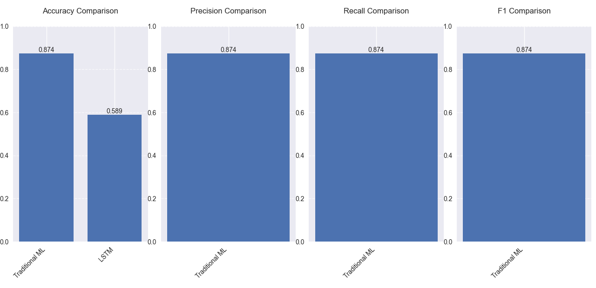
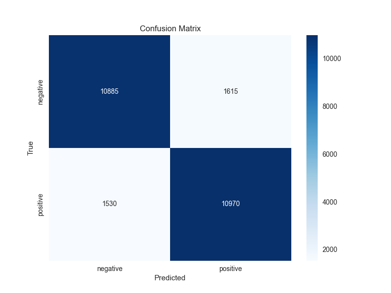
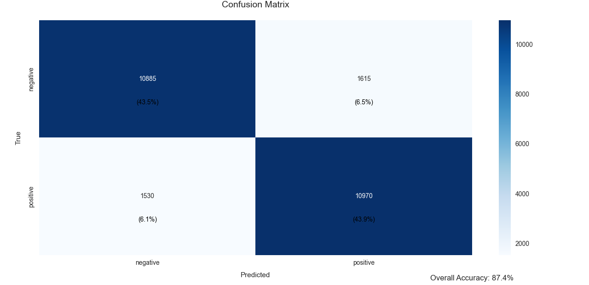

# Sentiment Analysis Project

A comprehensive Natural Language Processing (NLP) project for sentiment analysis using both traditional machine learning and deep learning approaches.

## 🌟 Features

- Dual model implementation:
  - Traditional ML: TF-IDF + Logistic Regression
  - Deep Learning: LSTM with word embeddings
- Interactive API endpoints using FastAPI
- Comprehensive visualization tools
- Extensive data preprocessing pipeline
- Model performance comparison utilities

## 🚀 Quick Start

1. Clone the repository:
```bash
git clone https://github.com/gitarber/sentiment-analysis
cd sentiment-analysis
```

2. Install dependencies:
```bash
pip install -r requirements.txt
```

3. Download and prepare the dataset:
```bash
python src/data/download_data.py
```

4. Train the models:
```bash
python src/train_models.py
```

5. Start the API server:
```bash
python src/run_api.py
```

## 📊 Project Structure

```
sentiment-analysis/
├── data/                  # Data directory
│   ├── raw/              # Raw data files
│   └── processed/        # Processed data files
├── models/               # Saved model files
├── notebooks/           # Jupyter notebooks
├── src/                 # Source code
│   ├── api/            # API implementation
│   ├── data/           # Data processing scripts
│   ├── models/         # Model implementations
│   └── visualization/  # Visualization utilities
├── tests/              # Test files
├── .gitignore         # Git ignore file
├── requirements.txt   # Project dependencies
└── README.md         # Project documentation
```

## 📓 Notebooks

- `notebooks/1_Data_Exploration.ipynb`: Dataset analysis and preprocessing steps
- `notebooks/2_Model_Training.ipynb`: Model training and evaluation process
- `notebooks/3_Model_Analysis.ipynb`: Detailed model performance analysis
- `notebooks/4_API_Usage.ipynb`: Examples of using the API endpoints

## 🛠️ API Endpoints

- `/`: Welcome message
- `/health`: Health check
- `/analyze/traditional`: Analyze sentiment using traditional ML
- `/analyze/lstm`: Analyze sentiment using LSTM
- `/analyze/batch/traditional`: Batch analysis with traditional ML
- `/analyze/batch/lstm`: Batch analysis with LSTM
- `/models/info`: Get model information

## 📈 Visualization Tools

- Confusion matrices
- Training history plots
- Model comparison charts
- Feature importance analysis
- Attention weights visualization (for LSTM)

## 📸 Screenshots

### Model Performance


### API Interface


### Visualization Examples


## 🧪 Testing

Run the test suite:
```bash
pytest tests/
```

## 📝 License

This project is licensed under the MIT License - see the [LICENSE](LICENSE) file for details.

## 🤝 Contributing

1. Fork the repository
2. Create your feature branch (`git checkout -b feature/AmazingFeature`)
3. Commit your changes (`git commit -m 'Add some AmazingFeature'`)
4. Push to the branch (`git push origin feature/AmazingFeature`)
5. Open a Pull Request 